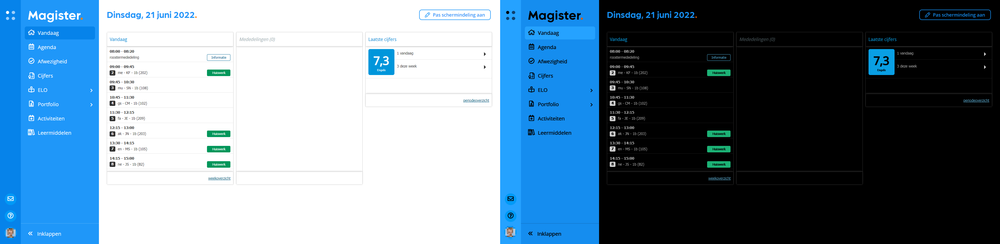

# Magister tweaks

## dark mode
dark mode flips the colors on screen except profile images

## setup
### downloading the extension
1. at the top of the page click on the '**code**' button
2. click on the '**download zip**' button
3. unzip the file

### importing the extension
1. go to chrome://extensions
2. click on load **unpacked extension** in the top bar
3. select the folder inside the 'Magister-tweaks-master' folder
